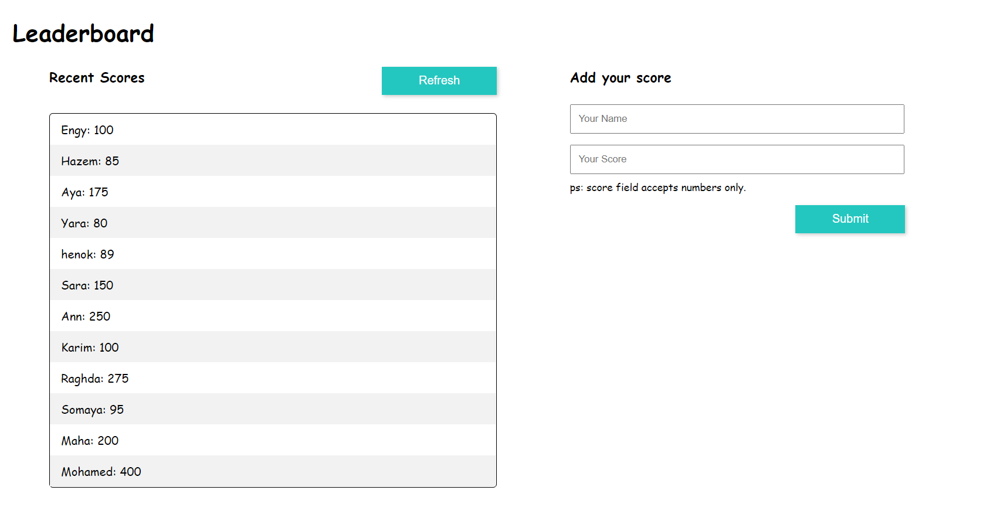

# leaderboard-list

A "Leaderboard List" is a tool that helps to fetch the leaderboard list, which contains names and scores. In addition, a new name and score can be added to this list. This list was built with ES6 and Webpack.

<!--  -->
## Built With

- ES6
- webpack, webpack-cli
- html-webpack-plugin
- style-loader, css-loader
- webpack-dev-server

<!-- 
## Live Demo

[Live Demo Link]( https://maha-magdy.github.io/To-Do-List/ ) -->

## Getting Started

**To get a local copy up and running follow these simple steps.**

### Prerequisites

- Windows, Mac or Linux machine 

### Setup

- Clone this repo run this code on a terminal window: 

```
git clone https://github.com/Maha-Magdy/leaderboard-list.git
```

- Install needed webpack packages
```
npm install
```

- Run local server
```
npm run start
```

### Usage

- Put this url in your browser http://localhost:8080/, and start use Leaderboard List.
  

## Author

👤 **Maha Magdy**

- GitHub: [Maha-Magdy](https://github.com/Maha-Magdy)
- Twitter: [@Maha_M_Abdelaal](https://twitter.com/Maha_M_Abdelaal)
- LinkedIn: [Maha Magdy](https://www.linkedin.com/in/maha-magdy-abdelaal/)


## 🤝 Contributing

Contributions, issues, and feature requests are welcome!

Feel free to check the [issues page]( https://github.com/Maha-Magdy/leaderboard-list/issues ).

## Show your support

Give a ⭐️ if you like this project!

## Acknowledgments

- [webpack](https://webpack.js.org/)

## 📝 License

This project is [MIT](./LICENSE) licensed.


